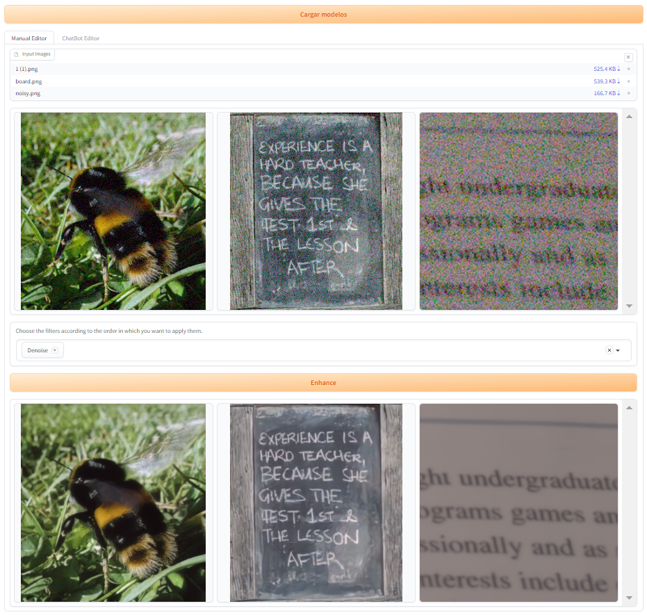

# Image Enhancement TFG

Este proyecto proporciona herramientas y modelos para la mejora de imágenes. A continuación se detallan los pasos necesarios para clonar el repositorio, configurar el entorno y ejecutar el proyecto.




## Requisitos

Asegúrate de cumplir con los siguientes requisitos antes de continuar:

- Python 3.10 o 3.11
- CUDA 12.1

## Instalación

Primero, clona el repositorio (branch dev) a tu máquina local utilizando Git:

```bash
git clone -b dev https://github.com/joelvp/ImageEnhancementTFG.git
cd ImageEnhancementTFG
```

### Instalar CUDA 12.1

CUDA es necesario para aprovechar la potencia de la GPU en ciertos modelos de este proyecto. Para instalar CUDA 12.1, sigue estos pasos:

1. Descarga el instalador de CUDA 12.1 desde el [sitio web de Nvidia](https://developer.nvidia.com/cuda-12-1-0-download-archive).
2. Sigue las instrucciones de instalación proporcionadas por Nvidia para tu sistema operativo.
3. Asegúrate de que los controladores de tu GPU están actualizados y son compatibles con CUDA 12.1.

### Creación de Entorno Conda

Crea un nuevo entorno de Conda para gestionar las dependencias del proyecto:

```bash
conda create --name ImageEnhancementTFG python=3.10
conda activate ImageEnhancementTFG
```

### Instalación de Poetry y Librerias
Usaremos Poetry como gestor de dependencias:

```bash
pip install poetry
poetry install
```

### Configuración Adicional
Algunas configuraciones adicionales son necesarias para ciertos modelos. Navega al directorio denoise_deblur y ejecuta el siguiente comando:


```bash
cd imageenhancementtfg/models/denoise_deblur
python setup.py develop --no_cuda_ext
```

## Estructura del proyecto

### Archivos de configuracion
Ubicar los archivos de configuracion las siguientes ubicaciones:

	ImageEnhancementTFG/
	│
    ├── imageenhancementtfg/
    │       ├── data/
    │       │   ├── model_config/
    │       │   │   ├── deblur_config.yml
    │       │   │   ├── denoise_config.yml
    │       │   │   ├── lowlight_config.yml
    │       │   │   └── skyreplace_config.json
    │       │   │
    │       │   ├── config.ini
    │       │   ├── prompts.json
    │       │   └── ...
    │       │

### Archivos de configuracion
Ubicar los [modelos preentrenados](https://upvedues-my.sharepoint.com/:f:/g/personal/jvaldep_upv_edu_es/EsQPv2soyHJCgMl7RHhjES0BuzWIhhIof5u6AjSbBUlxBQ?e=v6S3Lb) en las siguientes ubicaciones:

    │       ├── models/
    │       │   ├── denoise_deblur/
    │       │   │   ├── experiments/
    │       │   │   │   └── pretrained_models/
    │       │   │   │       ├── NAFNet-REDS-width64.pth
    │       │   │   │       └── NAFNet-SIDD-width64.pth
    │       │   │   │
    │       │   │   └── ...
    │       │   │
    │       │   ├── lens_distortion/
    │       │   │   ├── models/
    │       │   │   │   ├── modelo1.pth
    │       │   │   │   ├── modelo2.pth
    │       │   │   │   └── ergan/
    │       │   │   │
    │       │   │   └── ...
    │       │   │
    │       │   ├── llama/
    │       │   │   └── ...
    │       │   │
    │       │   ├── low_light/
    │       │   │   ├── code/
    │       │   │   │   ├── models/
    │       │   │   │   │   ├── pretrained/
    │       │   │   │   │   │   └── LOLv2.pth
    │       │   │   │   │   │
    │       │   │   │   │   └── ...
    │       │   │   │   │
    │       │   │   │   └── ...
    │       │   │   │ 
    │       │   │   └── ...
    │       │   │
    │       │   ├── sky_replace/
    │       │   │   ├── model/
    │       │   │   │   └── best.ckpt.pt
    │       │   │   │
    │       │   │   └── ...
    │       │   │
    │       │   ├── white_balance/
    │       │   │   ├── models/
    │       │   │   │   ├── net_awb.pth
    │       │   │   │   └── net.pth
    │       │   │   │
    │       │   │   └── ...
    │       │   │
    │       │   └── ...


### Estructura completa
	ImageEnhancementTFG/
	│
    ├── imageenhancementtfg/
    │       ├── data/
    │       │   ├── model_config/
    │       │   │   ├── deblur_config.yml
    │       │   │   ├── denoise_config.yml
    │       │   │   ├── lowlight_config.yml
    │       │   │   └── skyreplace_config.json
    │       │   │
    │       │   ├── config.ini
    │       │   ├── prompts.json
    │       │   └── ...
    │       │
    │       ├── models/
    │       │   ├── denoise_deblur/
    │       │   │   ├── experiments/
    │       │   │   │   └── pretrained_models/
    │       │   │   │       ├── NAFNet-REDS-width64.pth
    │       │   │   │       └── NAFNet-SIDD-width64.pth
    │       │   │   │
    │       │   │   ├── deblur.py
    │       │   │   ├── denoise.py
    │       │   │   └── ...
    │       │   │
    │       │   ├── lens_distortion/
    │       │   │   ├── models/
    │       │   │   │   ├── modelo1.pth
    │       │   │   │   ├── modelo2.pth
    │       │   │   │   └── ergan/
    │       │   │   │
    │       │   │   ├── data/
    │       │   │   │   ├── dataset_generate_augmentation.py
    │       │   │   │   └── distorsion_model.py
    │       │   │   │
    │       │   │   ├── train/
    │       │   │   │   ├── trainS.ipynb
    │       │   │   │   ├── trainSweeps.ipynb
    │       │   │   │   └── ...
    │       │   │   │
    │       │   │   ├── lens_distortion.py
    │       │   │   └── ...
    │       │   │
    │       │   ├── llama/
    │       │   │   ├── objects/
    │       │   │   │   └── llama_response.py
    │       │   │   │
    │       │   │   ├── llama.py
    │       │   │   ├── utils.py
    │       │   │   └── ...
    │       │   │
    │       │   ├── low_light/
    │       │   │   ├── code/
    │       │   │   │   ├── models/
    │       │   │   │   │   ├── pretrained/
    │       │   │   │   │   │   └── LOLv2.pth
    │       │   │   │   │   │
    │       │   │   │   │   └── ...
    │       │   │   │   │
    │       │   │   │   ├── lowlight.py
    │       │   │   │   └── ...
    │       │   │   │ 
    │       │   │   └── ...
    │       │   │
    │       │   ├── sky_replace/
    │       │   │   ├── model/
    │       │   │   │   └── best.ckpt.pt
    │       │   │   │
    │       │   │   ├── sky_replace.py
    │       │   │   └── ...
    │       │   │
    │       │   ├── white_balance/
    │       │   │   ├── models/
    │       │   │   │   ├── net_awb.pth
    │       │   │   │   └── net.pth
    │       │   │   │
    │       │   │   ├── white_balance.py
    │       │   │   └── ...
    │       │   │
    │       │   └── utils.py
    │       │
    │       ├── src/
    │       │   ├── objects/
    │       │   │   ├── model.py
    │       │   │   └── model_manager.py
    │       │   │
    │       │   └── utils.py
    │       │
    │       └── gui.py
    ├── figures/
    │       └── ...
    ├── LICENSES/
    │       ├── README.md
    │       └── ...
    ├── .gitignore
    ├── poetry.lock
    ├── pyproject.toml
    ├── LICENSE
    ├── Memory.pdf
    └── README.md

### Explicación archivos

#### Subdirectorio: imageenhancementtfg/
#### 1. data/
Este directorio contiene archivos de configuración y otros datos necesarios para el proyecto.

- **model_config/**: Contiene archivos de configuración para los diferentes modelos (deblur, denoise, lowlight, skyreplace).

- **config.ini**: Archivo de configuración principal del proyecto.
- **prompts.json**: Contiene prompts utilizados en la generación del chatbot basado en una LLM de LamaAPI.

#### 2. models/
Este directorio alberga diferentes modelos y sus scripts relacionados.

- **denoise_deblur/**: Contiene modelos y scripts relacionados con la eliminación de ruido y desenfoque.
  - **deblur.py**: Subclase de la clase abstracta Model, para corregir el desenfoque o movimiento.
  - **denoise.py**: Subclase de la clase abstracta Model, para corregir el ruido.

- **lens_distortion/**: Contiene modelos y scripts para la corrección de distorsión de lente con efecto de ojo de pez.
  - **data/**
    - **dataset_generate_augmentation.py**: Script para generar y aumentar datasets para entrenamiento de modelos de corrección de distorsion de lentes.
    - **distorsion_model.py**: Contiene el modelo para simular la distorsión de lentes.
  - **train/**
    - **trainS.ipynb**: Notebook de Jupyter para entrenar el modelo de distorsión de lentes.
    - **trainSweeps.ipynb**: Notebook de Jupyter para buscar la mejor combinación de hiperparametros con la herramienta Sweeps de Weight&Bias.
  - **lens_distortion.py**: Subclase de la clase abstracta Model, para corregir la distorsion de lente.

- **llama/**: Contiene modelos y scripts relacionados con la implementación de LlamaAPI
  - **objects/**
    - **llama_response.py**: Objeto para instanciar las respuestas de la api de Llama
  - **llama.py**: Clase para la generacion de respuestas con LLM.
  - **utils.py**: Funciones utilitarias para el módulo llama.

- **low_light/**: Contiene modelos y scripts para la mejora de imágenes con poca luz.
  - **code/**
    - **lowlight.py**: Subclase de la clase abstracta Model, para imagenes oscuras.

- **sky_replace/**: Contiene modelos y scripts para el reemplazo del cielo en imágenes.
  - **sky_replace.py**: Subclase de la clase abstracta Model, para sustituir el cielo.

- **white_balance/**: Contiene modelos y scripts para la corrección automática del balance de blancos.
  - **white_balance.py**: Subclase de la clase abstracta Model, para corregir el balance de blancos.

- **utils.py**: Funciones utilitarias generales utilizadas en diferentes modelos.

#### 3. src/
Este directorio contiene código fuente y scripts de soporte.

- **objects/**: Contiene clases de objetos y sus gestores.
  - **model.py**: Clase abstracta para la implementacion de cargar modelos y procesar imagenes.
  - **model_manager.py**: Clase para gestionar los diferentes modelos en el proyecto.

- **utils.py**: Funciones utilitarias generales utilizadas en todo el proyecto.

#### 4. gui.py
Script donde se utiliza Gradio para crear una interfaz gráfica de usuario. Donde poder mejorar imagenes con diferentes modelos de deep learning.

### Archivos en el Directorio Principal

- **.gitignore**: Especifica los archivos y directorios que deben ser ignorados por Git.
- **poetry.lock**: Archivo de bloqueo generado por Poetry para asegurar instalaciones consistentes.
- **pyproject.toml**: Define los metadatos del proyecto y las dependencias gestionadas por Poetry.
- **LICENSES**: Contiene las licencias de los repositorios usados en este proyecto.
- **figures**: Contiene las images utilizadas en el README.md
- **LICENSE**: Contiene la información de la licencia para el proyecto.
- **Memory.pdf**: Memoria de la estructura y creación del proyecto.
- **README.md**: Proporciona una visión general del proyecto, incluyendo instrucciones de instalación y guías de uso.


## Ejecutar Proyecto

Vuelve a la carpeta imageenhancementtfg y ejecuta el script principal:

```bash
cd ../..
python gui.py
```
### Citations

```
@article{
  title={ImageEnhancementTFG},
  author={Joel Valverde de Pedro},
  year={2024}
}
```

### License

Shield: [![CC BY-NC-SA 4.0][cc-by-nc-sa-shield]][cc-by-nc-sa]

This work is licensed under a
[Creative Commons Attribution-NonCommercial-ShareAlike 4.0 International License][cc-by-nc-sa].

[![CC BY-NC-SA 4.0][cc-by-nc-sa-image]][cc-by-nc-sa]

[cc-by-nc-sa]: http://creativecommons.org/licenses/by-nc-sa/4.0/
[cc-by-nc-sa-image]: https://licensebuttons.net/l/by-nc-sa/4.0/88x31.png
[cc-by-nc-sa-shield]: https://img.shields.io/badge/License-CC%20BY--NC--SA%204.0-lightgrey.svg